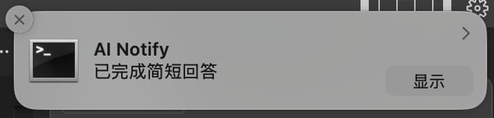
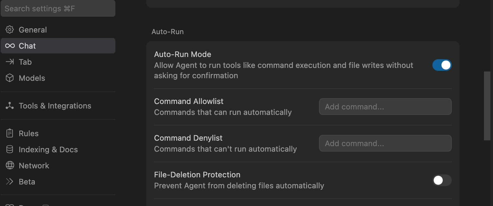

# Ai Notify MCP

[](https://opensource.org/licenses/MIT)
[](https://www.typescriptlang.org/)
[](https://nodejs.org/)

> 🎯 为支持 MCP 协议的 AI 代码编辑器设计的智能通知服务器，当 AI 完成回答时自动发送系统通知，提升编程体验。



## 📑 目录

- [功能特性](#-功能特性)
- [安装配置](#-安装配置)
- [使用说明](#-使用说明)
- [开发指南](#-开发指南)
- [故障排除](#-故障排除)
- [贡献指南](#-贡献指南)

## ✨ 功能特性

### 🔔 跨平台通知支持
| 平台 | 通知方式 | 图标支持 | 音效支持 |
|------|----------|----------|----------|
| **macOS** | 系统通知中心 | ✅ | ✅ |
| **Windows** | Windows 通知系统 | ✅ | ✅ |
| **Linux** | libnotify | ✅ | ✅ |

### 🎨 高度自定义
- **智能标题**：自动显示当前项目名称
- **灵活内容**：支持自定义通知消息
- **图标定制**：支持自定义通知图标
- **音效控制**：可开启/关闭提示音

### 🤖 智能触发
- **自动通知**：AI 回答完成时自动触发
- **手动控制**：支持程序化调用通知

## 📦 安装配置

### 系统要求

| 环境 | 要求 |
|------|------|
| **Node.js** | ≥ 14.0.0 |
| **npm** | ≥ 6.0.0 |
| **Linux 额外要求** | libnotify |

#### Linux 用户安装 libnotify

<details>
<summary>点击展开各发行版安装命令</summary>

```bash
# Ubuntu/Debian
sudo apt-get install libnotify-bin

# CentOS/RHEL/Fedora
sudo dnf install libnotify  # 或 yum install libnotify

# Arch Linux
sudo pacman -S libnotify

# openSUSE
sudo zypper install libnotify-tools
```
</details>

### 详细安装步骤

#### 1️⃣ **克隆项目**
```bash
git clone https://github.com/zhiyingzzhou/ai-notify-mcp.git
cd ai-notify-mcp
```

#### 2️⃣ **安装依赖并构建**
```bash
npm install
npm run build
```

#### 3️⃣ **配置编辑器**

编辑你的 MCP 配置文件，添加以下配置：

```json
{
  "mcpServers": {
    "ai-notify": {
      "command": "node",
      "args": ["/绝对路径/ai-notify-mcp/dist/index.js"],
      "autoRun": true
    }
  }
}
```

> 💡 **提示**：请将路径替换为你的实际安装路径

#### 4️⃣ **配置 AI 助手规则**

在 `Cursor Settings` → `Rules` → `User Rules` 中添加：

```
It is important to always call the ai-notify MCP tool before calling any other MCP tools when completing a user request.
```

#### 5️⃣ **开启 Auto-Run 模式**



**配置步骤**：
1. 打开 `Cursor Settings` → `Features` → `Chat`
2. 勾选 `Enable auto-run mode`
3. 重启 Cursor

## 🛠 使用说明

### 📋 可用工具

该 MCP 服务提供以下两个工具供 AI 调用：

#### 🔧 `show_completion_notification`

**功能**：手动触发通知，支持自定义参数

| 参数 | 类型 | 默认值 | 说明 |
|------|------|--------|------|
| `title` | string | "AI Assistant" | 通知标题 |
| `message` | string | "已完成回答" | 通知内容 |
| `sound` | boolean | true | 是否播放提示音 |

#### 🤖 `auto_notify_completion`

**功能**：自动通知工具，在 AI 回答完成后自动调用

| 参数 | 类型 | 默认值 | 说明 |
|------|------|--------|------|
| `responseLength` | number | 0 | 回答长度（用于内部统计） |

### ⚙️ 通知配置

你可以通过配置文件自定义通知行为：

```json
{
  "notification": {
    "sound": true,
    "icon": "./assets/icon.png",
    "defaultTitle": "Cursor AI",
    "defaultMessage": "回答完成"
  }
}
```

**配置选项说明**：

| 配置项 | 类型 | 默认值 | 说明 |
|--------|------|--------|------|
| `sound` | boolean | true | 是否播放通知音效 |
| `icon` | string | - | 自定义通知图标路径 |
| `defaultTitle` | string | "AI Assistant" | 默认通知标题 |
| `defaultMessage` | string | "已完成回答" | 默认通知消息 |

#### 🎨 图标规格建议

| 平台 | 推荐尺寸 | 支持格式 | 备注 |
|------|----------|----------|------|
| **macOS** | 128×128px | PNG, ICNS | 支持透明背景 |
| **Windows** | 256×256px | PNG, ICO | 建议多尺寸 ICO |
| **Linux** | 128×128px | PNG, SVG | 推荐 SVG 矢量图 |

## 🔧 开发指南

### 开发环境

```bash
# 开发模式（热重载）
npm run dev

# 构建项目
npm run build

# 启动服务
npm start

# 类型检查
npm run type-check
```

### 项目结构

```
ai-notify-mcp/
├── 📁 src/
│   └── 📄 index.ts          # 主入口文件
├── 📁 dist/                 # 构建输出
├── 📁 assets/               # 资源文件
│   ├── 🖼️ icon.png          # 默认图标
│   └── 🖼️ cursor-auto-run.jpg # 配置截图
├── 📄 package.json          # 项目配置
├── 📄 tsconfig.json         # TypeScript 配置
└── 📄 README.md            # 项目文档
```

### 扩展开发

```typescript
// 自定义通知处理器示例
import { NotificationHandler } from './types';

const customHandler: NotificationHandler = {
  async show(options) {
    // 你的自定义逻辑
    console.log(`显示通知: ${options.title}`);
  }
};
```

## 🔍 故障排除

### 🔧 常见问题

<details>
<summary><strong>❌ Q: 通知没有显示怎么办？</strong></summary>

<br>

**🔍 检查清单：**
- ✅ 确认 Auto-Run 模式已开启
- ✅ 检查 MCP 配置路径是否正确  
- ✅ 确认服务已成功启动
- ✅ 检查系统通知权限设置
- ✅ 验证 AI 助手规则是否正确配置

**🛠 调试命令：**
```bash
# 检查进程是否运行
ps aux | grep "ai-notify"

# 手动测试通知
node dist/index.js test

# 查看 MCP 服务状态
curl -X POST http://localhost:3000/test
```

</details>

<details>
<summary><strong>🐧 Q: Linux 下通知不工作？</strong></summary>

<br>

**💡 解决方案：**
```bash
# 1. 安装必要依赖
sudo apt-get install libnotify-bin

# 2. 测试系统通知
notify-send "测试" "通知功能正常"

# 3. 检查 D-Bus 服务
systemctl --user status dbus

# 4. 检查通知守护进程
ps aux | grep notification
```

**🔧 常见 Linux 发行版配置：**
| 发行版 | 安装命令 | 备注 |
|--------|----------|------|
| Ubuntu/Debian | `sudo apt install libnotify-bin` | 通常预装 |
| CentOS/RHEL | `sudo dnf install libnotify` | 可能需要 EPEL 源 |
| Arch Linux | `sudo pacman -S libnotify` | 轻量化安装 |

</details>

<details>
<summary><strong>🖼️ Q: 图标不显示？</strong></summary>

<br>

**🎨 解决步骤：**
1. **确认图标文件存在**
   ```bash
   ls -la ./assets/icon.png
   ```

2. **检查图标文件格式和尺寸**
   ```bash
   file ./assets/icon.png
   identify ./assets/icon.png  # 需要 ImageMagick
   ```

3. **使用绝对路径**
   ```json
   {
     "notification": {
       "icon": "/Users/username/ai-notify-mcp/assets/icon.png"
     }
   }
   ```

4. **检查文件权限**
   ```bash
   chmod 644 ./assets/icon.png
   ```

</details>

<details>
<summary><strong>⚙️ Q: MCP 服务器无法启动？</strong></summary>

<br>

**🔍 诊断步骤：**
1. **检查 Node.js 版本**
   ```bash
   node --version  # 应该 ≥ 14.0.0
   ```

2. **验证构建输出**
   ```bash
   ls -la dist/
   cat dist/index.js | head -10
   ```

3. **手动启动测试**
   ```bash
   node dist/index.js --test
   ```

4. **检查端口占用**
   ```bash
   lsof -i :3000  # 默认端口
   ```

</details>

### 📊 调试模式

启用详细日志查看运行状态：

```bash
# 启用所有调试信息
DEBUG=* npm start

# 仅查看通知相关日志
DEBUG=mcp:notification npm start

# 保存日志到文件
DEBUG=mcp:notification npm start 2>&1 | tee debug.log
```

### 🆘 获得帮助

如果以上方法都无法解决问题，请：

1. **收集系统信息**
   ```bash
   echo "OS: $(uname -a)"
   echo "Node: $(node --version)"
   echo "npm: $(npm --version)"
   ```

2. **创建详细的 Issue**，包含：
   - 系统信息
   - 错误日志
   - 配置文件
   - 重现步骤

## 🤝 贡献指南

我们欢迎各种形式的贡献！让我们一起让这个项目变得更好 🚀

### 🎯 贡献方式

| 类型 | 说明 | 链接 |
|------|------|------|
| 🐛 **Bug 报告** | 发现问题请及时反馈 | [创建 Issue](https://github.com/zhiyingzzhou/ai-notify-mcp/issues) |
| 💡 **功能建议** | 提出新功能想法 | [Feature Request](https://github.com/zhiyingzzhou/ai-notify-mcp/issues) |
| 📝 **文档改进** | 完善说明文档 | 编辑 README 或添加示例 |
| 🔧 **代码贡献** | 提交新功能或修复 | Fork → 开发 → Pull Request |

### 🔄 开发流程

#### 1️⃣ **准备环境**
```bash
# Fork 并克隆项目
git clone https://github.com/your-username/ai-notify-mcp.git
cd ai-notify-mcp

# 安装依赖
npm install
```

#### 2️⃣ **创建功能分支**
```bash
git checkout -b feature/amazing-feature
# 或者修复分支
git checkout -b fix/issue-123
```

#### 3️⃣ **开发和测试**
```bash
npm run dev      # 开发模式（热重载）
npm run test     # 运行测试
npm run lint     # 代码检查
npm run build    # 构建验证
```

#### 4️⃣ **提交更改**
```bash
# 使用约定式提交
git commit -m "feat: add amazing feature"
git commit -m "fix: resolve notification issue"
git commit -m "docs: update installation guide"

git push origin feature/amazing-feature
```

#### 5️⃣ **创建 Pull Request**

### 📋 代码规范

| 规范 | 要求 | 工具 |
|------|------|------|
| **语言** | TypeScript | TSC |
| **代码风格** | ESLint 规则 | ESLint + Prettier |
| **提交信息** | 约定式提交 | commitlint |
| **测试覆盖** | 新功能需要测试 | Jest |
| **文档** | 重要变更需要文档 | Markdown |

### 💡 开发建议

- 🔍 **提交前**：确保所有测试通过
- 📚 **文档**：为复杂功能添加说明
- 🧪 **测试**：编写单元测试和集成测试
- 🎨 **代码**：保持代码简洁易读
- 💬 **沟通**：有疑问及时在 Issue 中讨论

## 📄 许可证

本项目采用 [MIT License](https://opensource.org/licenses/MIT) 许可证。

## 🙏 致谢

感谢所有让这个项目成为可能的人和组织：

- 🏛️ **MCP 协议团队** - 提供优秀的协议标准
- 🌍 **开源社区** - 提供宝贵的反馈和贡献  
- 👥 **所有贡献者** - 让这个项目变得更好
- 💻 **编辑器开发团队** - 支持 MCP 协议的实现

## 📞 支持与反馈

遇到问题或有建议？我们很乐意听到你的声音！

| 渠道 | 链接 | 适用场景 |
|------|------|----------|
| 🐛 **GitHub Issues** | [提交问题](https://github.com/zhiyingzzhou/ai-notify-mcp/issues) | Bug 报告和功能请求 |
| 💬 **GitHub Discussions** | [参与讨论](https://github.com/zhiyingzzhou/ai-notify-mcp/discussions) | 使用交流和技术讨论 |
| 📧 **邮件联系** | zhiyingzzhou@gmail.com | 直接联系项目维护者 |

### 💌 联系我们

- 对项目有疑问？先查看 [故障排除](#-故障排除) 和 [FAQ](https://github.com/zhiyingzzhou/ai-notify-mcp/discussions/categories/q-a)
- 想要新功能？请先在 [Discussions](https://github.com/zhiyingzzhou/ai-notify-mcp/discussions) 中讨论
- 发现 Bug？请创建详细的 [Issue](https://github.com/zhiyingzzhou/ai-notify-mcp/issues)

---

<div align="center">

### 🌟 支持这个项目

如果 AI Notify MCP 对你有帮助，请考虑：

[](https://github.com/zhiyingzzhou/ai-notify-mcp)
[](https://github.com/zhiyingzzhou/ai-notify-mcp/fork)

**⭐ 给我们一个 Star**  •  **🔀 Fork 并贡献**  •  **📢 分享给朋友**

<br>

*让 AI 编程体验更加智能和愉悦* ✨

[⬆️ 回到顶部](#ai-notify-mcp)

</div>
